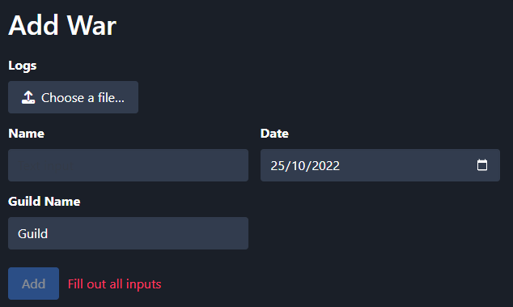

# Uploading Logs

Go to your Dashboard → Wars.&#x20;

There you will find the button to add a new war.

<figure><figcaption></figcaption></figure>

By uploading a file first it will autofill the Name-Input. The Guild-Name-Input should be adjusted to your guild.
